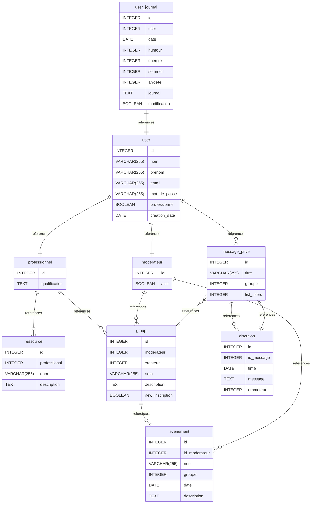

# TheTeams documentation
## Summary

- [Introduction](#introduction)
- [Database Type](#database-type)
- [Table Structure](#table-structure)
	- [user](#user)
	- [group](#group)
	- [ressource](#ressource)
	- [user_journal](#user_journal)
	- [evenement](#evenement)
	- [professionnel](#professionnel)
	- [moderateur](#moderateur)
	- [message_prive](#message_prive)
	- [discution](#discution)
- [Relationships](#relationships)
- [Database Diagram](#database-diagram)

## Introduction

## Database type

- **Database system:** PostgreSQL
## Table structure

### user

| Name        | Type          | Settings                      | References                    | Note                           |
|-------------|---------------|-------------------------------|-------------------------------|--------------------------------|
| **id** | INTEGER | 🔑 PK, not null, unique, autoincrement | fk_user_id_professionnel,fk_user_id_moderateur,fk_user_id_message_prive | |
| **nom** | VARCHAR(255) | not null |  | |
| **prenom** | VARCHAR(255) | not null |  | |
| **email** | VARCHAR(255) | not null, unique |  | |
| **mot_de_passe** | VARCHAR(255) | not null |  | |
| **professionnel** | BOOLEAN | not null, default: False |  | |
| **creation_date** | DATE | not null |  | | 

### group

| Name        | Type          | Settings                      | References                    | Note                           |
|-------------|---------------|-------------------------------|-------------------------------|--------------------------------|
| **id** | INTEGER | 🔑 PK, not null, unique, autoincrement | fk_group_id_evenement | |
| **moderateur** | INTEGER | not null |  | |
| **createur** | INTEGER | not null |  | |
| **nom** | VARCHAR(255) | not null |  | |
| **description** | TEXT | not null |  | |
| **new_inscription** | BOOLEAN | not null, default: True |  | | 

### ressource

| Name        | Type          | Settings                      | References                    | Note                           |
|-------------|---------------|-------------------------------|-------------------------------|--------------------------------|
| **id** | INTEGER | 🔑 PK, not null, unique, autoincrement |  | |
| **professional** | INTEGER | not null |  | |
| **nom** | VARCHAR(255) | not null |  | |
| **description** | TEXT | not null |  | | 

### user_journal

| Name        | Type          | Settings                      | References                    | Note                           |
|-------------|---------------|-------------------------------|-------------------------------|--------------------------------|
| **id** | INTEGER | 🔑 PK, not null, unique, autoincrement | fk_user_journal_id_user | |
| **user** | INTEGER | not null |  | |
| **date** | DATE | not null |  | |
| **humeur** | INTEGER | not null |  | |
| **energie** | INTEGER | not null |  | |
| **sommeil** | INTEGER | not null |  | |
| **anxiete** | INTEGER | not null |  | |
| **journal** | TEXT | not null |  | |
| **modification** | BOOLEAN | not null, default: True |  | | 

### evenement

| Name        | Type          | Settings                      | References                    | Note                           |
|-------------|---------------|-------------------------------|-------------------------------|--------------------------------|
| **id** | INTEGER | 🔑 PK, not null, unique, autoincrement |  | |
| **id_moderateur** | INTEGER | not null |  | |
| **nom** | VARCHAR(255) | not null |  | |
| **groupe** | INTEGER | not null |  | |
| **date** | DATE | not null |  | |
| **description** | TEXT | not null |  | | 

### professionnel

| Name        | Type          | Settings                      | References                    | Note                           |
|-------------|---------------|-------------------------------|-------------------------------|--------------------------------|
| **id** | INTEGER | 🔑 PK, not null, unique, autoincrement | fk_professionnel_id_ressource,fk_professionnel_id_group | |
| **qualification** | TEXT | not null |  | | 

### moderateur

| Name        | Type          | Settings                      | References                    | Note                           |
|-------------|---------------|-------------------------------|-------------------------------|--------------------------------|
| **id** | INTEGER | 🔑 PK, not null, unique, autoincrement | fk_moderateur_id_evenement,fk_moderateur_id_group | |
| **actif** | BOOLEAN | null |  | | 

### message_prive

| Name        | Type          | Settings                      | References                    | Note                           |
|-------------|---------------|-------------------------------|-------------------------------|--------------------------------|
| **id** | INTEGER | 🔑 PK, not null, unique, autoincrement | fk_message_prive_id_discution | |
| **titre** | VARCHAR(255) | null |  | |
| **groupe** | INTEGER | null | fk_message_prive_groupe_group | |
| **list_users** | INTEGER | not null | fk_message_prive_list_users_discution | | 

### discution

| Name        | Type          | Settings                      | References                    | Note                           |
|-------------|---------------|-------------------------------|-------------------------------|--------------------------------|
| **id** | INTEGER | 🔑 PK, not null, unique, autoincrement |  | |
| **id_message** | INTEGER | not null |  | |
| **time** | DATE | not null |  | |
| **message** | TEXT | not null |  | |
| **emmeteur** | INTEGER | null |  | | 

## Relationships

- **user to professionnel**: one_to_one
- **professionnel to ressource**: one_to_many
- **professionnel to group**: one_to_many
- **group to evenement**: one_to_many
- **user to moderateur**: one_to_one
- **moderateur to evenement**: one_to_many
- **moderateur to group**: one_to_many
- **user_journal to user**: one_to_one
- **user to message_prive**: one_to_many
- **message_prive to discution**: one_to_many
- **message_prive to discution**: one_to_one
- **message_prive to group**: many_to_one

## Database Diagram

